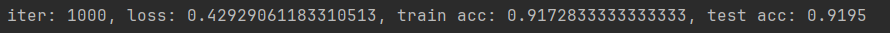
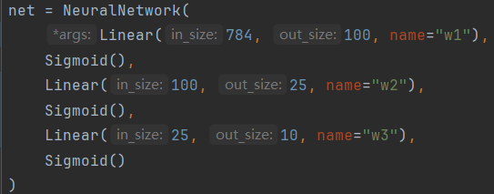
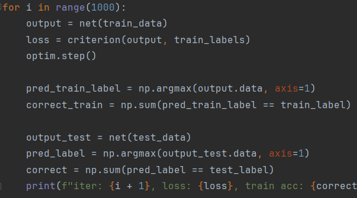

# 反向自动微分 & 全连接神经网络
## Auto Differential Reverse Mode & Fully-connected Neural Network

参考[自动微分](https://blog.csdn.net/aws3217150/article/details/70214422)，然后又自己写了一份  
不过会和 numpy 的运算符重载冲突，比如 `np.array[1,2,3]+x` 会变成 `[1+x, 2+x, 3+x]`，优先使用了 numpy 的运算符重载，正确的应该是 `[1,2,3]+x`

---
自动微分的测试用例在 `test.py` 里  
神经网络在 `network.py`，使用了MINST手写数据集  
准确率：  
  

可以调整的网络架构：  
  

训练：  
  

---
神经网络代码很丑（双手合十）
